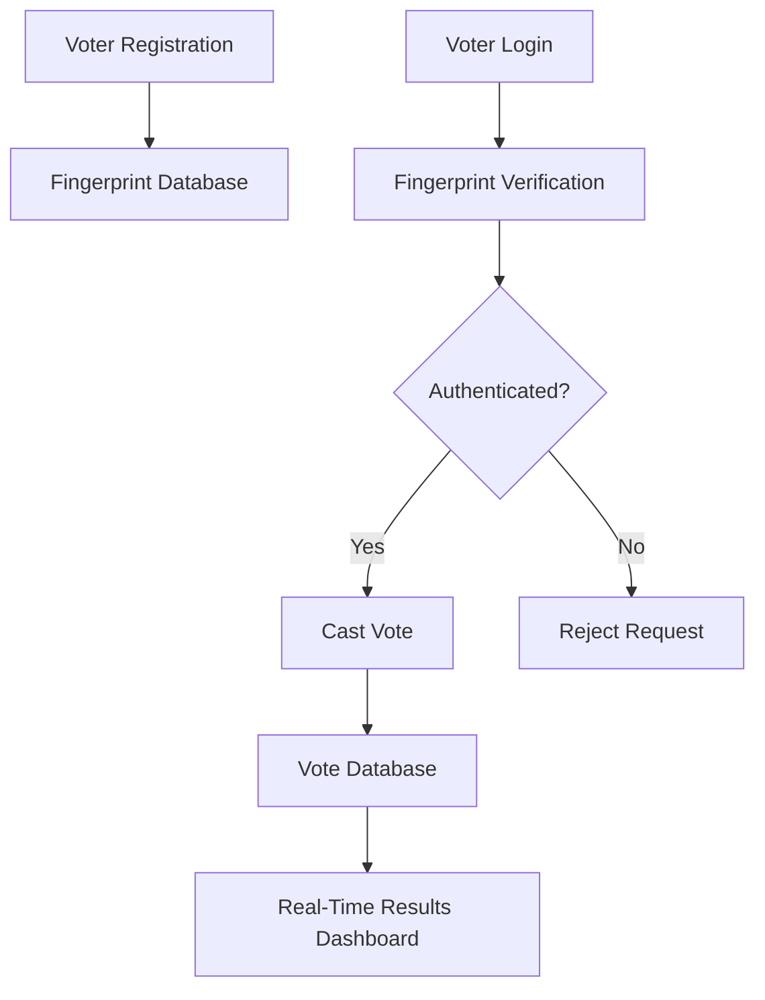

<div align="center">

# 🗳️ Fingerprint-Based Voting System

### Secure Biometric Voting Platform for Fraud-Free Elections

A production-inspired voting platform that uses **fingerprint authentication** to verify voter identity and enforce **one-person-one-vote integrity**. The system leverages biometric matching techniques and synthetic fingerprint datasets for secure authentication and testing.


</div>

---

## 📖 Overview

Election systems are vulnerable to identity fraud, duplicate voting, and manual verification errors. This project introduces a **biometric voting platform** that authenticates voters using fingerprint verification before allowing them to cast their vote.

The system demonstrates how biometric authentication can be integrated into digital election systems to improve **security, transparency, and trustworthiness**.

---

## ✨ Key Features

### 🔐 Fingerprint Authentication
Verify voter identity using fingerprint matching techniques.

### 📝 Voter Registration
Register voters along with their biometric information.

### 🚫 Duplicate Vote Prevention
Ensure each voter can vote only once.

### 📊 Real-Time Result Tracking
View election statistics and results instantly.

### 👨‍💼 Administrative Dashboard
Manage voters, elections, and monitor system activity.

### 🧪 Synthetic Dataset Integration
Uses synthetic fingerprint datasets from Kaggle for biometric testing and experimentation.

---

## 🏗️ System Architecture



---

## 🛠️ Tech Stack

| Layer | Technology |
|-------|------------|
| Frontend | React.js |
| Backend | Java |
| Database | MySQL |
| Authentication | Fingerprint Biometrics |
| Dataset | Synthetic Fingerprint Dataset (Kaggle) |

---

## 📂 Project Structure

```text
Fingerprint-Based-Voting-System/
│
├── frontend/
│   ├── components/
│   ├── pages/
│   ├── services/
│   └── assets/
│
├── backend/
│   ├── controllers/
│   ├── services/
│   ├── models/
│   ├── repositories/
│   └── config/
│
├── database/
│   └── schema.sql
│
├── docs/
│   ├── architecture.png
│   └── screenshots/
│
├── README.md
└── LICENSE
```

---

## 🗄️ Database Design

### Voters

| Field | Type |
|-------|------|
| voter_id | INT |
| name | VARCHAR |
| age | INT |
| fingerprint_id | VARCHAR |
| has_voted | BOOLEAN |

### Votes

| Field | Type |
|-------|------|
| vote_id | INT |
| voter_id | INT |
| candidate_id | INT |
| timestamp | DATETIME |

### Candidates

| Field | Type |
|-------|------|
| candidate_id | INT |
| name | VARCHAR |
| party | VARCHAR |

---

## 🚀 Getting Started

### Clone Repository

```bash
git clone https://github.com/Dharneesh0912/Fingerprint-Based-Voting-System.git
cd Fingerprint-Based-Voting-System
```

### Backend Setup

```bash
cd backend
# Configure database connection
# Run Java application
```

### Frontend Setup

```bash
cd frontend
npm install
npm start
```

---

## 📸 Screenshots

### Registration Portal
(Add Screenshot)

### Fingerprint Verification
(Add Screenshot)

### Voting Dashboard
(Add Screenshot)

### Election Results
(Add Screenshot)

---

## 🎯 Learning Outcomes

- Biometric Authentication Systems
- Secure User Verification
- Database Design
- Full Stack Application Development
- System Architecture Design
- Fraud Prevention Mechanisms
- Real-Time Data Processing

---

## 🔮 Future Enhancements

- Multi-factor authentication
- Face recognition integration
- Blockchain-based vote storage
- Cloud deployment
- Election analytics dashboard
- Role-based access control
- Encrypted biometric templates

---

## 🌟 Why This Project Matters

This project demonstrates how biometric technologies can be used to design secure digital election systems that reduce fraud, improve voter verification, and increase transparency in online voting environments.

---

<div align="center">

### Building Secure Digital Election Systems Through Biometrics

⭐ If you found this project interesting, consider giving it a star.

</div>
